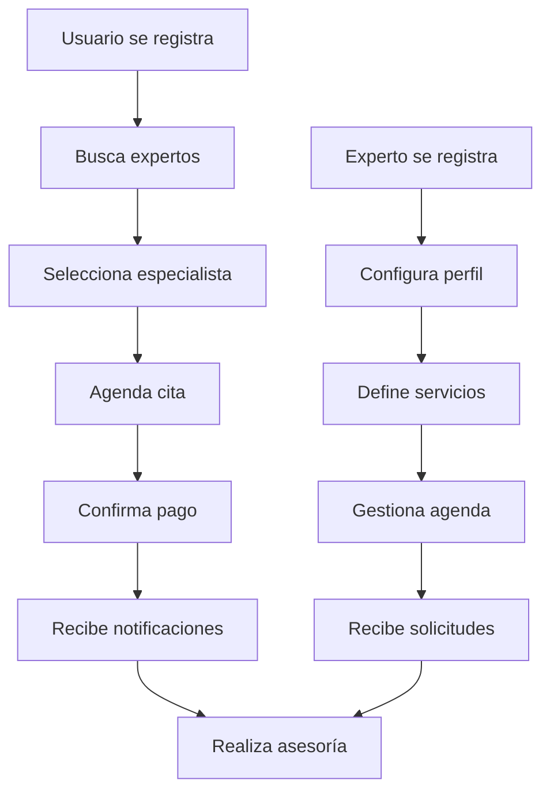

# SERVITECH 🔧

> **Plataforma web para conectar usuarios con expertos en tecnología**

ServiTech es una aplicación full-stack que facilita la conexión entre usuarios que necesitan asesoría técnica y expertos calificados en tecnología. Permite agendar citas, gestionar perfiles, procesar pagos y administrar servicios de manera integral.

[](https://nodejs.org/)
[](https://www.mongodb.com/)
[](https://opensource.org/licenses/MIT)

---

## 🎯 ¿Qué hace ServiTech?

- **Conecta** usuarios con expertos en tecnología
- **Facilita** el agendamiento de asesorías técnicas
- **Gestiona** perfiles de usuarios y especialistas
- **Procesa** pagos de forma segura
- **Administra** servicios a través de panel web

---

## 🚀 Características

### Para Usuarios

- ✅ Registro y login seguro
- 🔍 Búsqueda de expertos por especialidad
- 📅 Agendamiento de citas en tiempo real
- 💳 Pagos integrados y seguros
- 📧 Notificaciones automáticas por email

### Para Expertos

- 📋 Gestión de perfil profesional
- ⏰ Control de disponibilidad
- 💼 Administración de servicios
- 📊 Dashboard de citas y ganancias

### Para Administradores

- 🎛️ Panel de control completo
- 👥 Gestión de usuarios y expertos
- 📈 Estadísticas y reportes
- ⚙️ Configuración del sistema

---

## 🛠️ Stack Tecnológico

| Componente        | Tecnología              |
| ----------------- | ----------------------- |
| **Backend**       | Node.js + Express.js    |
| **Base de Datos** | MongoDB (Atlas)         |
| **Frontend**      | EJS + CSS3 + JavaScript |
| **Autenticación** | JWT + bcrypt            |
| **Emails**        | Nodemailer              |
| **UI Framework**  | Bootstrap               |

---

## ⚡ Inicio Rápido

### Prerrequisitos

- Node.js 18+ y npm 9+
- Git
- Cuenta MongoDB Atlas (gratuita)

### Instalación en 5 pasos

```bash
# 1. Clonar repositorio
git clone https://github.com/DianaJJ0/servitech.git
cd servitech

# 2. Instalar dependencias del backend
cd backend && npm install

# 3. Instalar dependencias del frontend
cd ../frontend && npm install

# 4. Configurar variables de entorno (ver INSTALL.md)
# Crear backend/.env con tus datos de MongoDB y email

# 5. Ejecutar aplicación
cd ../backend && npm start
# para admin:
cd ../frontend &&
```API_KEY=8g-X4JgECIPNcQ59tMN node server.js

### Acceso

- **🌐 Aplicación:** http://localhost:5021
- **🔐 Panel Admin:** http://localhost:5021/admin
- **📡 API:** http://localhost:5020

> 📖 **¿Necesitas ayuda?** Ver [Manual de Instalación Completo](./INSTALL.md)

---

## 📁 Estructura del Proyecto

```
servitech/
├── 🔧 backend/              # API REST + Lógica de negocio
│   ├── app.js              # Servidor principal
│   ├── controllers/        # Controladores MVC
│   ├── models/            # Esquemas MongoDB
│   ├── routes/            # Rutas API
│   └── middleware/        # Autenticación & validación
├── 🖥️ frontend/            # Interface de usuario
│   ├── server.js          # Servidor frontend
│   ├── views/             # Plantillas EJS
│   └── assets/            # CSS, JS, imágenes
├── 📋 INSTALL.md          # Manual técnico detallado
└── 📄 README.md           # Este archivo
```

---

## 🔄 Flujo de Trabajo



---

## 🎮 Uso Básico

### Como Usuario

1. **Registrarse** en http://localhost:5021/register
2. **Explorar** expertos disponibles
3. **Agendar** cita con el especialista
4. **Pagar** y recibir confirmación
5. **Conectar** en el horario acordado

### Como Experto

1. **Registrarse** como especialista
2. **Completar** perfil profesional
3. **Configurar** servicios y tarifas
4. **Gestionar** disponibilidad
5. **Atender** clientes agendados

### Como Administrador

1. **Acceder** al panel admin
2. **Supervisar** usuarios y expertos
3. **Gestionar** servicios y categorías
4. **Monitorear** estadísticas
5. **Configurar** parámetros del sistema

---

## 🚀 Deployment

### Desarrollo Local

```bash
npm run dev  # Si existe script de desarrollo
```

### Producción

```bash
npm run build  # Si existe script de build
npm start
```

Note: If you customize or bundle frontend assets for production, ensure the admin experts bootstrap file is included after the main script so deferred DOM-ready handlers run:

- /assets/js/admin/admin-expertos.js
- /assets/js/admin/admin-expertos.bootstrap.js

This file executes deferred onDomReady handlers used to initialize Choices and other UI helpers.

> 🔧 **Configuración avanzada:** Ver [INSTALL.md](./INSTALL.md) para deployment en Windows/Linux

---

## 🤝 Contribuir

1. **Fork** el repositorio
2. **Crear** rama feature (`git checkout -b feature/nueva-funcionalidad`)
3. **Commit** cambios (`git commit -m 'Añadir nueva funcionalidad'`)
4. **Push** a la rama (`git push origin feature/nueva-funcionalidad`)
5. **Abrir** Pull Request

---

## 📞 Soporte

| Canal                | Enlace                                                        |
| -------------------- | ------------------------------------------------------------- |
| 🐛 **Issues**        | [GitHub Issues](https://github.com/DianaJJ0/servitech/issues) |
| 📧 **Email**         | servitech.app.correo@gmail.com                                |
| 📚 **Documentación** | [Manual Completo](./INSTALL.md)                               |
| 👩‍💻 **Autor**         | [@DianaJJ0](https://github.com/DianaJJ0)                      |

---

## 📄 Licencia

Este proyecto está bajo la [Licencia MIT](LICENSE) - consulta el archivo LICENSE para más detalles.

---

<div align="center">

**¿Necesitas ayuda técnica? ¡ServiTech te conecta con los mejores expertos! 🚀**

[🌟 Dar una estrella](https://github.com/DianaJJ0/servitech) | [🐛 Reportar bug](https://github.com/DianaJJ0/servitech/issues) | [💡 Sugerir feature](https://github.com/DianaJJ0/servitech/issues)

</div>
