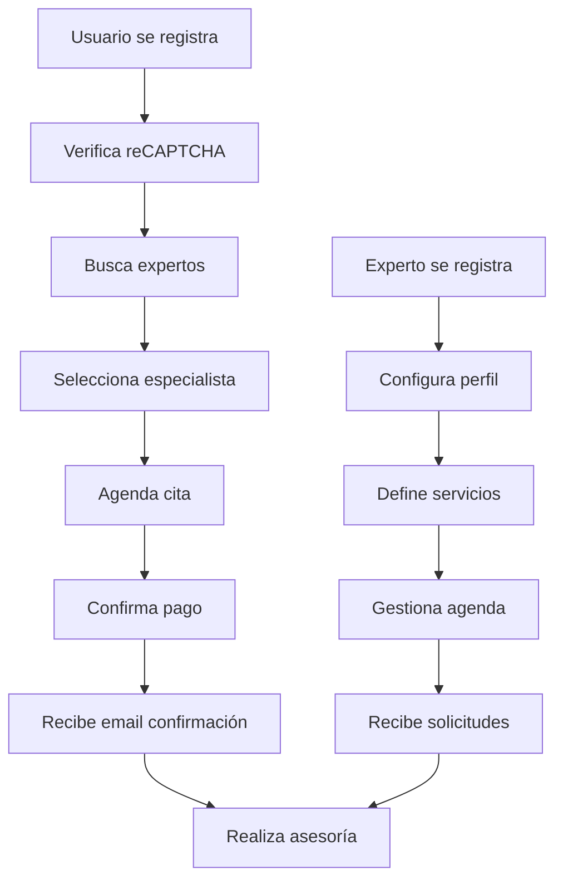

# SERVITECH 🔧

> **Plataforma web para conectar usuarios con expertos en tecnología**

ServiTech es una aplicación full-stack que facilita la conexión entre usuarios que necesitan asesoría técnica y expertos calificados en tecnología. Permite agendar citas, gestionar perfiles, procesar pagos y administrar servicios de manera integral.

[](https://nodejs.org/)
[](https://www.mongodb.com/)
[](https://render.com/)
[](https://opensource.org/licenses/MIT)

---

## 🎯 ¿Qué hace ServiTech?

- **Conecta** usuarios con expertos en tecnología
- **Facilita** el agendamiento de asesorías técnicas
- **Gestiona** perfiles de usuarios y especialistas
- **Procesa** pagos de forma segura
- **Administra** servicios a través de panel web

---

## 🚀 Características

### Para Usuarios

- ✅ Registro y login seguro con reCAPTCHA v2
- 🔍 Búsqueda de expertos por especialidad
- 📅 Agendamiento de citas en tiempo real
- 💳 Pagos integrados y seguros
- 📧 Notificaciones automáticas por email
- 🔒 Recuperación de contraseña

### Para Expertos

- 📋 Gestión de perfil profesional
- ⏰ Control de disponibilidad
- 💼 Administración de servicios
- 📊 Dashboard de citas y ganancias

### Para Administradores

- 🎛️ Panel de control completo
- 👥 Gestión de usuarios y expertos
- 📈 Estadísticas y reportes
- ⚙️ Configuración del sistema

---

## 🛠️ Stack Tecnológico

| Componente        | Tecnología                  |
| ----------------- | --------------------------- |
| **Backend**       | Node.js + Express.js        |
| **Base de Datos** | MongoDB (Atlas)             |
| **Frontend**      | EJS + CSS3 + JavaScript     |
| **Autenticación** | JWT + bcrypt                |
| **Emails**        | Nodemailer (Gmail)          |
| **Seguridad**     | Google reCAPTCHA v2         |
| **Deployment**    | Render (servidor unificado) |

---

## ⚡ Inicio Rápido

### Prerrequisitos

- Node.js 18+ y npm 9+
- Git
- Cuenta MongoDB Atlas (gratuita)
- Cuenta Gmail con App Password para emails

### 🔧 Desarrollo Local

```bash
# 1. Clonar repositorio
git clone https://github.com/DianaJJ0/servitech.git
cd servitech

# 2. Instalar dependencias del backend
cd backend && npm install

# 3. Instalar dependencias del frontend
cd ../frontend && npm install

# 4. Configurar variables de entorno
# Crear backend/.env con:
# - MONGO_URI (tu string de MongoDB Atlas)
# - JWT_SECRET (clave segura larga)
# - EMAIL_USER y EMAIL_PASS (Gmail App Password)
# - RECAPTCHA_SITE_KEY y RECAPTCHA_SECRET_KEY

# 5. Modo desarrollo (2 servidores separados)
# Terminal 1 - Backend API:
cd backend && npm run dev  # Puerto 5020

# Terminal 2 - Frontend con proxy:
cd frontend && npm run dev  # Puerto 5021
```

### 🌐 Acceso en Desarrollo

- **Frontend:** http://localhost:5021 (interfaz principal)
- **Backend API:** http://localhost:5020 (solo API)
- **Panel Admin:** http://localhost:5021/admin/adminUsuarios

### 🚀 Modo Producción (Servidor Unificado)

En producción, el backend sirve tanto la API como las vistas del frontend:

```bash
# Solo el backend ejecutándose
cd backend && npm start  # Puerto configurado por Render
```

**Producción en Render:** https://servitech-2bja.onrender.com

---

## 📁 Estructura del Proyecto

```
servitech/
├── 🔧 backend/              # Servidor principal (API + Vistas)
│   ├── app.js              # Servidor unificado
│   ├── controllers/        # Controladores MVC
│   ├── models/            # Esquemas MongoDB
│   ├── routes/            # Rutas API
│   ├── middleware/        # Autenticación & validación
│   └── .env               # Variables de entorno
├── 🖥️ frontend/            # Assets y vistas (servido por backend)
│   ├── server.js          # Router de vistas (importado por backend)
│   ├── views/             # Plantillas EJS
│   ├── assets/            # CSS, JS, imágenes
│   └── .env               # Variables desarrollo (opcional)
├── 📋 INSTALL.md          # Manual técnico detallado
└── 📄 README.md           # Este archivo
```

---

## 🔄 Flujo de Trabajo



---

## 🎮 Uso Básico

### Como Usuario

1. **Registrarse** en /registro.html con verificación reCAPTCHA
2. **Explorar** expertos en /expertos.html
3. **Agendar** cita con el especialista
4. **Pagar** y recibir confirmación por email
5. **Conectar** en el horario acordado

### Como Experto

1. **Registrarse** como usuario normal
2. **Completar** perfil experto en /registroExperto
3. **Configurar** servicios y tarifas
4. **Gestionar** disponibilidad en /editarExperto
5. **Atender** clientes agendados

### Como Administrador

1. **Acceder** al panel /admin/adminUsuarios
2. **Supervisar** usuarios y expertos
3. **Gestionar** categorías y servicios
4. **Monitorear** logs del sistema
5. **Configurar** parámetros globales

---

## 🚀 Deployment

### Variables de Entorno Requeridas

#### Desarrollo Local (backend/.env)

```env
# Base de datos
MONGO_URI=mongodb+srv://...

# Autenticación
JWT_SECRET=clave-super-secreta-larga

# Email (Gmail)
EMAIL_HOST=smtp.gmail.com
EMAIL_PORT=465
EMAIL_USER=tu-gmail@gmail.com
EMAIL_PASS=tu-app-password

# reCAPTCHA
RECAPTCHA_SITE_KEY=6Lc...
RECAPTCHA_SECRET_KEY=6Lc...

# URLs desarrollo
FRONTEND_URL=http://localhost:5021
BACKEND_URL=http://localhost:5020
```

#### Producción (Variables Render)

```env
# Mismas variables que desarrollo +
NODE_ENV=production
RENDER_EXTERNAL_URL=https://tu-app.onrender.com
PORT=configurado-por-render

# Sin FRONTEND_URL ni BACKEND_URL (servidor unificado)
```

### Deploy en Render

1. **Conectar** repositorio GitHub a Render
2. **Configurar** Web Service:
   - **Root Directory:** `backend`
   - **Build Command:** `npm run build`
   - **Start Command:** `npm start`
3. **Añadir** variables de entorno en panel Environment
4. **Desplegar** automáticamente

---

## 🔧 Scripts Disponibles

### Backend

```bash
npm start          # Servidor producción (unificado)
npm run dev        # Servidor desarrollo con nodemon
npm run build      # Instala deps frontend + backend
```

### Frontend

```bash
npm start          # Servidor frontend standalone
npm run dev        # Desarrollo con nodemon + proxy
npm run dev:proxy  # Desarrollo con proxy al backend
```

---

## 🤝 Contribuir

1. **Fork** el repositorio
2. **Crear** rama feature (`git checkout -b feature/nueva-funcionalidad`)
3. **Desarrollar** en modo local (2 servidores)
4. **Probar** en modo unificado antes de PR
5. **Commit** cambios (`git commit -m 'Añadir nueva funcionalidad'`)
6. **Push** a la rama (`git push origin feature/nueva-funcionalidad`)
7. **Abrir** Pull Request

---

## 📞 Soporte

| Canal                | Enlace                                                        |
| -------------------- | ------------------------------------------------------------- |
| 🐛 **Issues**        | [GitHub Issues](https://github.com/DianaJJ0/servitech/issues) |
| 📧 **Email**         | servitech.app.correo@gmail.com                                |
| 📚 **Documentación** | [Manual Completo](./INSTALL.md)                               |
| 🌐 **Demo Live**     | https://servitech-2bja.onrender.com                           |
| 👩‍💻 **Autor**         | [@DianaJJ0](https://github.com/DianaJJ0)                      |

---

## 📄 Licencia

Este proyecto está bajo la [Licencia MIT](LICENSE) - consulta el archivo LICENSE para más detalles.

---

<div align="center">

**¿Necesitas ayuda técnica? ¡ServiTech te conecta con los mejores expertos! 🚀**

[🌟 Dar una estrella](https://github.com/DianaJJ0/servitech) | [🐛 Reportar bug](https://github.com/DianaJJ0/servitech/issues) | [💡 Sugerir feature](https://github.com/DianaJJ0/servitech/issues)

</div>
